# Technical Solution
My program can be divded into multiple parts each one working to solve a specific problem/goal. 

## Display Sprites function
For this I used nested loops to iterate through each column and row of my 2D array containing the data for the sprite. 

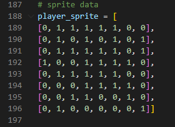
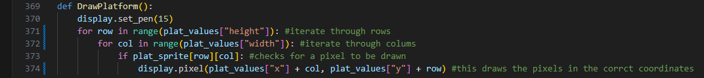

*For each unique sprite I made a draw function like the one above*

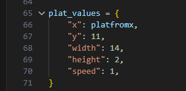

*Each sprites data is stored in a dictionary, see above*

Then each main game loop the functions to draw the sprites are called. 

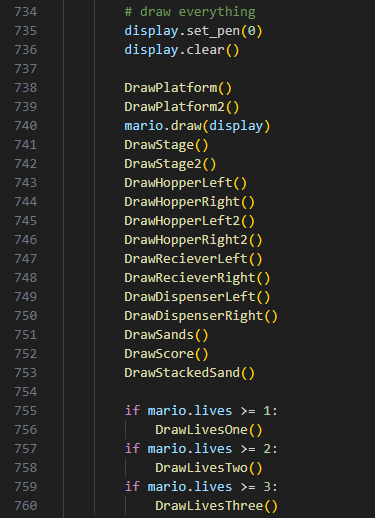

*The if statements control how many lives are drawn based on how many lives the user has left*

## Player 
For the player I decided to encapsulate it into a class and would initialise an instance of it called mario. I made sure that the class would take in all the attributes it needed. 

It takes in:
  * list of x coordinates
  * list of y coordinates
  * indexes for both y and x coordinates
  * lives
  * sprite data (width, height, 2D array)

It also creates the attributes
  * x and y coordinate, taken from the current index of the lists

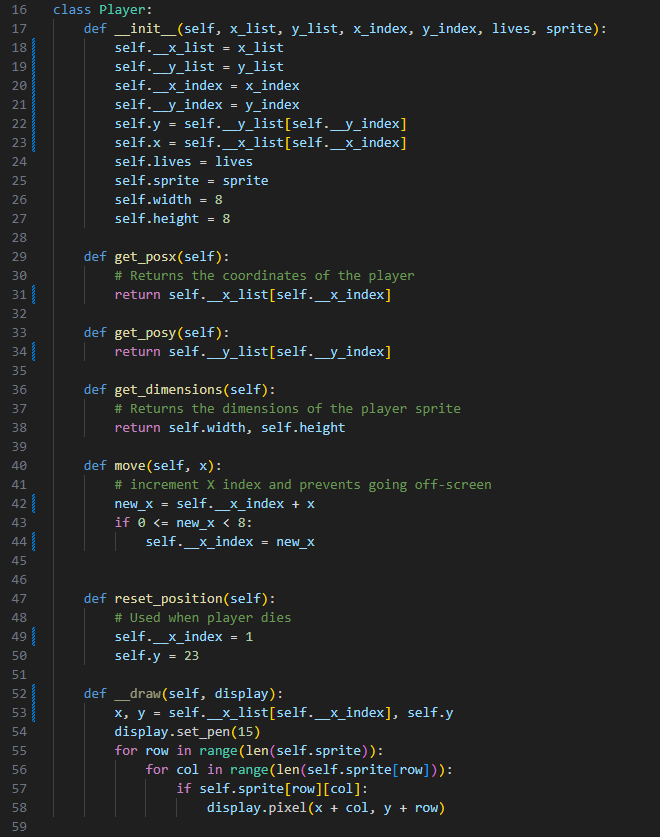

In here I have created getter and setter methods in order to access privated data so the main game loop and other subroutines can access data such as the current y coordinates of the player character. There is also the reseting position function and the draw function. The reset function reseets the index and y coordinate to the starting values. While the draw function is the same as the other ones for the other sprites. 

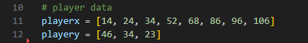

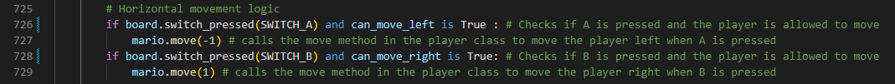

For the movement I decided to use a predefined set of x coordinates that the player could go to. When the player moves left and right it cycles through the list (by incrementing the index by 1 or -1) containing these positions

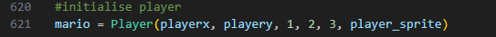

*Initialiser for player character object*

## Player hitbox detection 
This subroutine is used keep the player on the static levels in the stage. It utilises pixel overlap detection to detect if the player character is on a solid platform. It takes the lowest y coordinate of the player sprite and then iterates using a condition controlled loop through the 2D array for the stage sprite to see if there is a pixel there. 

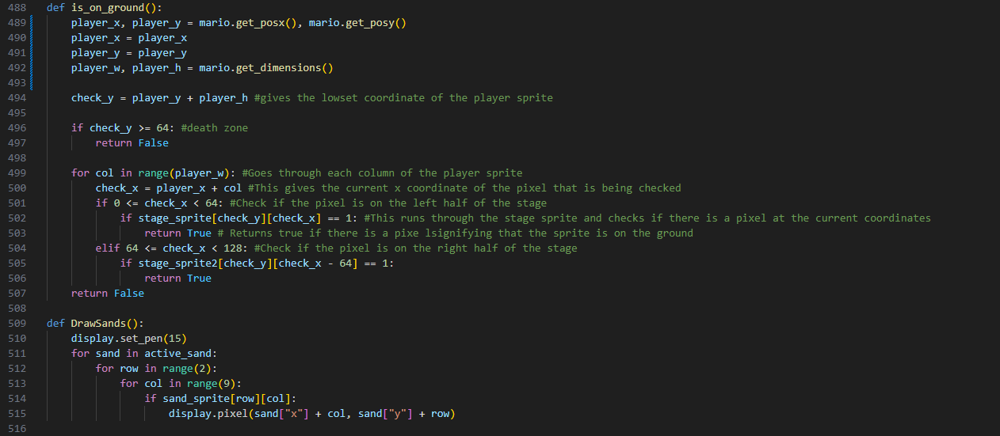

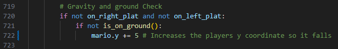

*This is in the main game loop and actually creates the gravity falling effect*

## Player Death
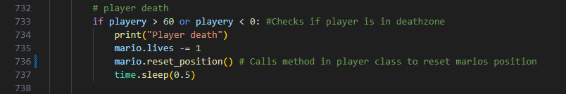

This is ran at the end of every game loop to check if the player is in the deathzone. 

## Platform Movement
The two middle platforms also have preset coordinates stored in an array. Then in order to move them I iterate through the y coordinates list.

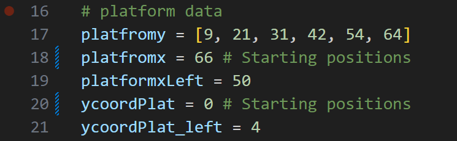

data:
  * platformy is the list of possible positions
  * platfomx and platformxLeft store the starting coordinates
  * ycoordPlat and ycoordPlat_left store the indexes for which coordinate each platform is on

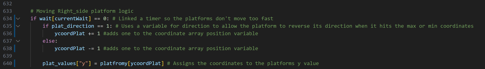

This utilises selection to see if the platforms are currently moving up or down and then continue move the platforms in that direction by incrementing the index. Unless they are the at the bottom of the range of y coordinates.

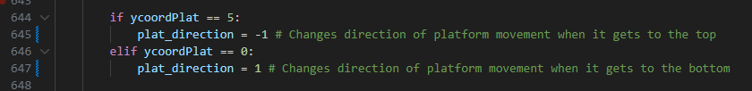

Here the direction is changed once the end of the y coordinates list is reached

## Keeping the Player on the moving platforms
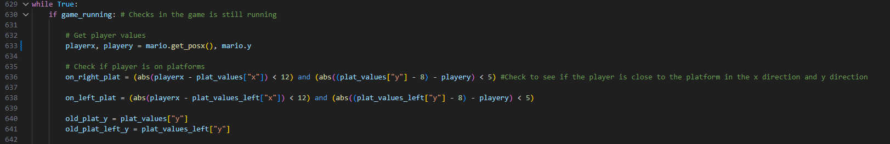

Here I first get the player character objects coordinate values. Then I use to booleans which are set to True if the player characters coordinates are in the close vicinity of the platforms. 

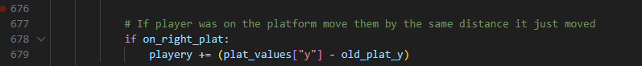

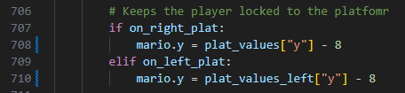

This calculates a rough area around the player character to see if it is close to any moving platforms it then moves the player character with a platform if it is near.  

## Preventing the player from moving out of bounds
In the lower levels undeneath the main platform levels the area the player can move to narrows. However there is a safe zone that you can move but it only exists on the right side. Therefore I utilised a series of selection statements to control which areas the player could move in. I used two seperate variables as my state controls one for left movement and one for right movement. I had to do this as they should be able to move from platform to platform and into the safe zone so locking the player movement completely was not possible.  

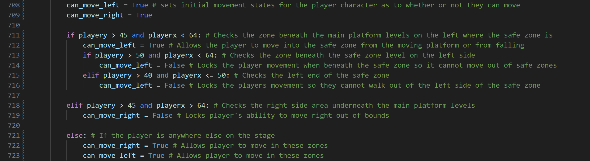

## Global timer system
Due to the amount of moving objects in my game I implemented a simple timer system. An array that increments its position variable by 1 each game frame. 
This allows me to dicate at what timings certain events should be able to happen. *See platform movement*

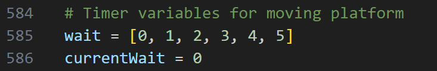

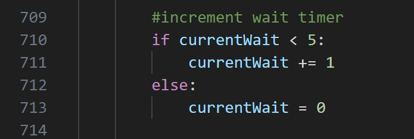

## Initialising Sand
For each individual sand spawning I create a dictionary for each of them and append them to a list of currently falling sand. This is so I can easily remove and add sand sprites. Update sand is called once per game loop this starts the whole sand calculation process as other sand related functions are called within this function. This improves the readability of main game loop. 

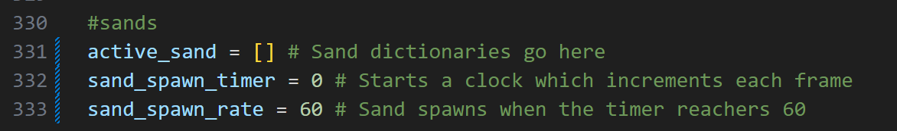

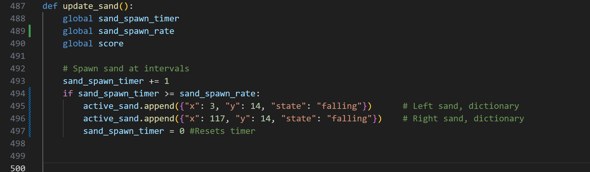

For drawing the sand I used a similar system to drawing the other sprites. However this time I also had it iterate through all the sands in the active sands list. 
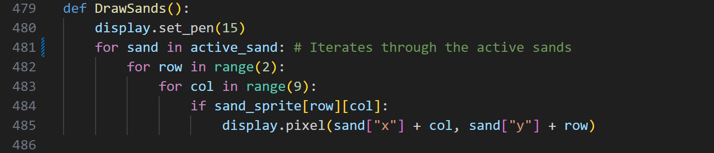

## Falling Sand and hopper interaction

To start with a timer is set to 0 then this increments each frame. When the counter hits 60 a sand sprite is "spawned". THis is done by appending a dictionary containing the data for x and y coordinates and also the current state it is in. 

Then I use a slice operation on the active_sand list and iterate through this sliced list. I use slicing because if I remove a sand dictionary from active_sand the index number will no longer line up with the original meaning some sand dictionaries will be missed when iterating through the active_sand list. Slicing allows me to iterate through a version of the list which data is not removed from so I will be able to iterate through with the corect index values. 

Then the code detects which hopper the sand is faling through removing the sand dictionary from active_sand and adding it to the hopper's storage list. 

It also calculates overflow so that if the amount of data in the hopper storage list is greater than three a life is lost. 

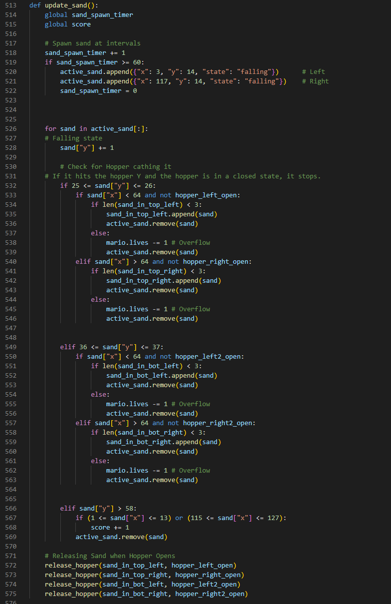

*Note this code is for the upper set of hoppers, it is repeated just with a different set of y coordinates*

## Release of sand from hoppers

This subroutine works by having a detection zone around the hopper, which if the player moves close enough (done through a process in the main game loop explaiend below) and there is sand in the hopper list (this is passed in when this subroutine is called from the update_sand subroutine, which allows me to not have to repeat code for all 4 hoppers) the top most sand dictionary is popped. This dictionary is then readded to the active_sand list.  

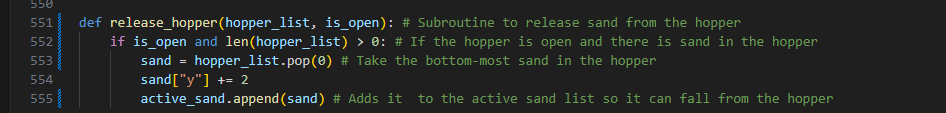

## Displaying sand being stacked in the hoopers
In order to be able to display the sand stacking I had a seperate subroutine for drawing stacked sand

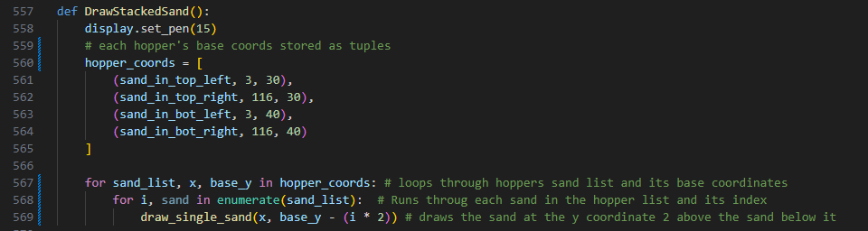

To get the position of each sand to be drawn I use the index of each sand in the list and multiply by 2. "i * 2" this makes the first appear sand at + 0y above the hopper, the second one at + 2y and the third at +4 y.   

## Player opening hoppers

This uses the absolute value of the coordinates of the player - the coordinates of the hopper to see if the player is close to the hopper. If it is the hopper open state is set to True. Otherwise the hopper open state is False. 

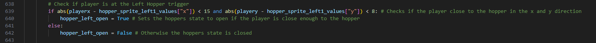

*Note: This is repeated for all 4 hoppers with their respective coordinates* The subroutine for releasing sand is called every game loop. *See release of sand from hoppers*

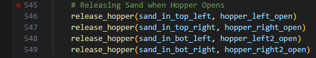

## Main game loop
The main game loop is contained inside a while loop. 

### Game over
If game_running is false then the main game loop switches to displaying a game over screen.

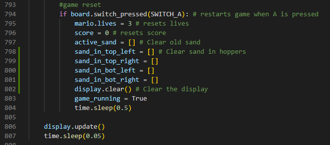

## Programming techniques used

  * Selection: Allows me to write code which will only run when certain conditions are met, collision detection, scoring, death zone detection. 
  * Iteration: Iterating through sprites to display them. 
  * Encapsulation: Encapsulating the player character. This helps simplify maintenence and the bug fixing of the code. 
  * Functions: Update sand, is on ground. These allow me to organise the code making it mroe maintainable. It also means I can use code more than once without having to rewrite it every single time I want to utilise it. 
  * Validation: Used primarily to keep the play in the bounds of the stage prveneting it from moving off screen.