# Mini NEA Project Title
  
**Candidate Name:** Yu-Chen Chiu 
**Candidate Number:** 1234  
**Centre Number:** 39253  
  
# Table of Contents
  
  
- [Mini NEA Project Title](#mini-nea-project-title )
- [Table of Contents](#table-of-contents )
  - [Analysis](#analysis )
  - [About the Nintendo Game & Watch](#about-the-nintendo-game--watch )
  - [Primary User](#primary-user )
  - [Research](#research )
    - [From the data](#from-the-data )
  - [Research of Game and Watch games](#research-of-game-and-watch-games )
    - [Marios Cement Factory](#marios-cement-factory )
    - [Zelda](#zelda )
  - [Deeper dive into Marios Cement Factory](#deeper-dive-into-marios-cement-factory )
  - [Approaching creating the game](#approaching-creating-the-game )
  - [Modelling](#modelling )
  - [Documented Design](#documented-design )
  - [Interface breakdown](#interface-breakdown )
  - [Main game loops](#main-game-loops )
  - [Sub-processes](#sub-processes )
  - [Creating the sprites](#creating-the-sprites )
    - [pixilart.com](#pixilartcom )
    - [Excel](#excel )
  - [User interface](#user-interface )
    - [Display](#display )
    - [Sprites](#sprites )
    - [Player interaction](#player-interaction )
  - [Algorithms](#algorithms )
    - [Collision/Gravity *is_on_ground* algorithm](#collisiongravity-is_on_ground-algorithm )
    - [Sand management *update_sand* algoritm](#sand-management-update_sand-algoritm )
  - [Usage of object oriented programming](#usage-of-object-oriented-programming )
    - [Attributes](#attributes )
    - [Methods](#methods )
  - [Technical Design choices](#technical-design-choices )
  - [ISPO Chart](#ispo-chart )
  - [Technical Solution](#technical-solution )
  - [Testing](#testing )
  - [Evaluation](#evaluation )
  - [Objectives met](#objectives-met )
  - [Future improvement](#future-improvement )
  - [Indpendant Feedback](#indpendant-feedback )
  - [Conculsion](#conculsion )
  
## Analysis
  
## About the Nintendo Game & Watch
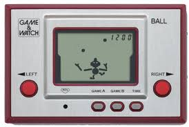
  
Game and Watches are a series of games consoles which started being release in 1980. Each console only conatined one game (depending on the model of the device) due to hardware restrictions and the design philosophy (a small protable device) at the time. Also due to these hardware restrictions games orignially were only in black and white due to the LCD screen type it used. Its name "Game and Watch" references its capability to display the time and a certain game. The console first released to great sucess leading to later generations being produced, the latest being the 40th anniversary version which released with colour, and games like the original "legend of Zelda". 
  
## Primary User
When looking into starting my project I need to first analyise my potential stackeholders and users that will be interacting with my product. In this case my primary user will be Jazz Guan, whom I will collaberate most with as she is the games target audience.
  
Jazz is enthustiastic towords video games in particular games that are esier to grasp, but with a fun gameplay loop which in this case is perfect for the Game and Watch series of consoles/games due to the fact that the hardware limitations of the device placed a threshold on how complicated the games on them could be. 
  
*What is your name and age: Jazz Guan, 17*  
*What features do you look for in a game: Easy to grasp basics, Cute art styles, Lore*  
*Recently played games: Silksong, Hades I, Risk of rain II*  
*What experiences are you looking for in a game: Relaxation, Excitation, Taking risks, Power trip*  
*Have you played retro games before: Pong*  
*Other features you might appreciate: Silly/cute stuff*  
  
  
  
Mr Wilde is also a possible candidate for the use of the device as he has a deep vested intrest towords the history of Computer Games and since the Game and Watch is so significant it would be prefect for him. 
  
## Research
### From the data
From my interview with my primary user Jazz I discovered the importance of having easy enough to grasp basics that gradually grows in difficulty. This is also in line with what I observe in the data gathered in a survey that was sent out.  
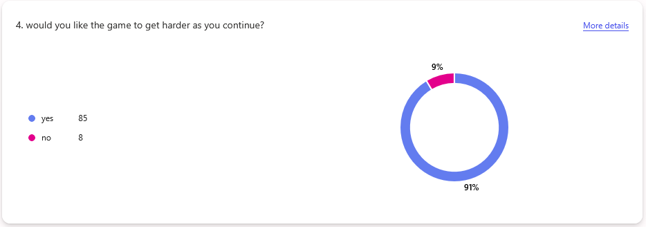
  
In terms of graphics 3D graphics was the most popular, however due to hardware limitations this would be impossible for my project. However the survey still shows a large demand for 2D graphics with a stylistic choice echoed by my interview with Jazz. 
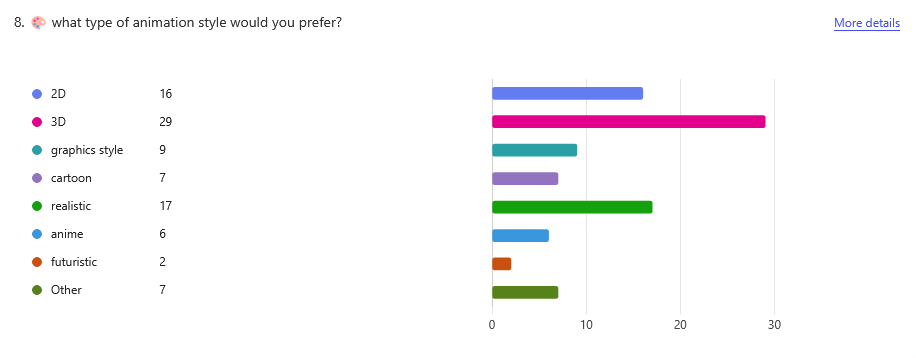
  
A large amount of users also said they liked hand held consoles which is appropriate for the project I'm developing. 
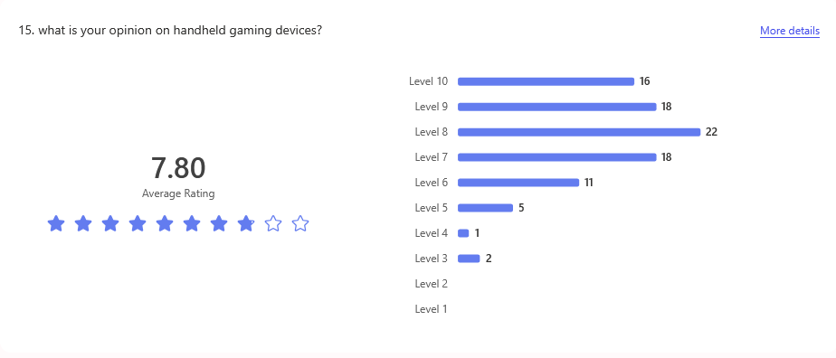
  
  
An average gaming session was recorded as being a couple of hours from **50%** of the repsonses. Therefore for my project the gameplay loop needs to be intresting enough for gameplay to not become stale after longer gaming sessions. 
  
A highly demanded feature was for a  leaderboard with **60%** of users demanding it. This would not be too hard to implement and would further entice users into playing the game more times in order to compete. 
  
## Research of Game and Watch games
* In order to find the best suited Game and Watch game for my mini NEA I decided to do a dive into two Game and Watch games:
  * Marios Cement Factory
  * Zelda (Game and Watch)
  
### Marios Cement Factory
In this game the goal is to have mario load cement, which falls from the two opposite ends of the screen, into trucks. In between there are two platforms which move up and down. This introduces an aspect of timing into the game where you need to be on the correct side of the screen at the correct time in order to let the cement through gates into the trucks. 
  
| Pros          | Cons             |
| :-----------: | :--------------: |
| Easier to grasp the main idea | Less room for skill expression |
| Simplier systems to implement | Repetetive gameplayloop can become boring |
  
**Table 1:** Marios cement factory (1983)
Purely looking at this games' gameplay loop it may not seem to be the most exciting however the timing of the moving platform and when the cement is delivered can still create some challenge. However where this game excels is that it balances fun to play with a simple enough design as the mechanics are fairly simple. The game can be split into four rough systems: moveable platforms, 2 sets of trapdoors that can open and close, player misses and finally player movement in 4 directions. Therefore we can see that the overall gameplay systems are not too complicated. 
  
  
### Zelda
This version of "Zelda" has a larger map which is displayed on the upper screen. On the bottom screen the game displays the current map area that Link is in along with the enemies in that area. It's final goal is to beat the 8 dungeons and collect all 8 shards of the TriForce of Wisdom. 
Due to hardware limitations it lacks deep story elements setting it apart from the other mainstream zelda games.
  
| Pros          | Cons             |
| :-----------: | :--------------: |
| More advanced gameplayloop  | Uses two screens |
| Larger map area     | More complicated sprites and systems to implement |
| More interactable mechanics | Ai is harder to implement |
  
**Table 2:** Zelda(1989)
Looking into this game's systems you can immediatly begin to see that Zelda(1989) is a much more complicated game. The game involves alot more gameplay mechanics with just the player character along having systems for: healing, multiple weapons, an inventory, multiple attack types and movement. Due to the more intricate systedms the game overall can have more replayability as it allows for more variation in gameplay. It also means that there is more room for skill expression which some may find rewarding. However due to the amount of complex systems actually creating the game becomes more difficault due to the amount of subsytems to deal with. 
  
When comparing the two games ultimatly I need a game which is not just fun but also easier to create, therefore I will choose to do **Mario's Cemenent Factory** as it provides a better balance between simplicity and enjoyability. 
  
## Deeper dive into Marios Cement Factory
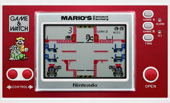
  
**Marios Cement Factory** Main gameplay
  
The main gameplayloop of this game is that the player, as Mario, moves between two sides of the screen, across different platforms tyring to empty cement into two trucks. The cement must fall through two sets of hoppers. Mario earns **one** point when Marios allows the cement to fall from the upper hopper and **two** points when it falls from the lower one. However each hopper can only hold up to three loads of sand, any overflow will cause Marios and in turn the player a miss. Otherways Mario can earn a miss are: Getting crushed by an elevator platform and reaching bottom of the elevator. There is a section at the bottom of the lift which the player can use to prvent themselves from falling all the way to the bottom. If a player reaches **300** points without a miss, the points will be worth **double** until a miss all misses will also be cleared. The game ends when the player reaches **3** misses.
  
## Approaching creating the game
From my understanding of Mario's Cement Factory I will lay out my main goals for the project. 
  
Goals: 
* Main objectives:
  * Create sprites, objective 1
  * Character movement objective 2
  * Falling of character when not on platform objective 3 
  * Hoppers
     * Interaction with Mario ,opening of hoppers objective 4
     * Capacity of 3 sand objective 5
  
  * Moving platforms
     * Mario moves with moving platforms if he is ontop of one objective 6
     * Moves at regular intervals objective 7
  
  * Point systems
     * Scoring system objective 8
     * Lives objective 9
     * Death system when not on a moving platform at the bottom of the elevator objective 10
     * Running out of lives end the game and shows a game over screen objective 11
  
  * Falling of sand objective 12
  * Resetting game when restart button is pressed objective 13
  
* Acceptable limitations:
   * Scoring values doubling once reaching 300 points
   * Leaderboard
   * Main menu
  
  
## Modelling
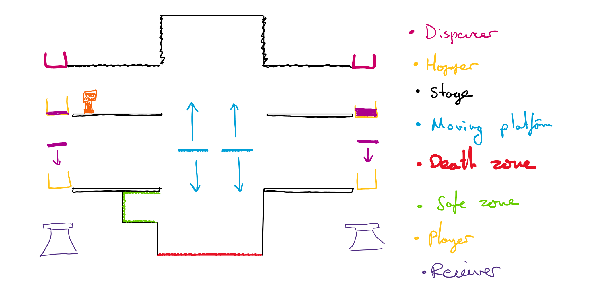
  
  
  
  
  
  
  
## Documented Design
  
During the creation of our programs for our Mini NEA we had to record our processes, documenting our thinking processes and solutions for our objectives. 
  
## Interface breakdown
The interface for my game is fairly simple. As soon as the program is loaded the game starts. When a the player loses all lives it switches to a game over screen. Then at the press of a button the game restarts. 
  
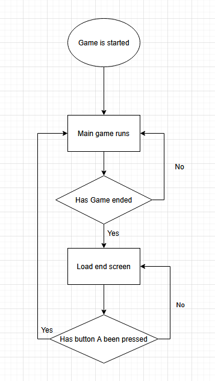
  
*Visual flowchart representation*
  
## Main game loops 
Due to the amount of objects moving on screen at one time. The order the game runs the seperate algorithms for each process in the game is very important. 
  
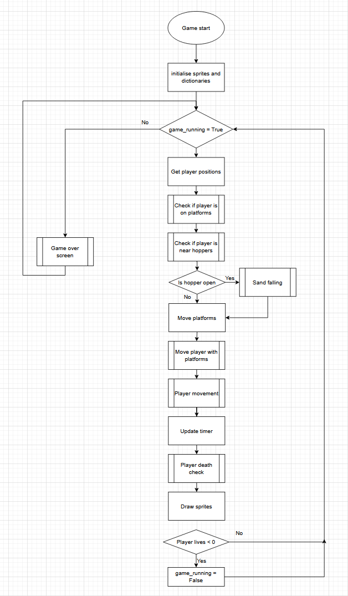
  
*Visual flowchart Game logic loop*
  
## Sub-processes 
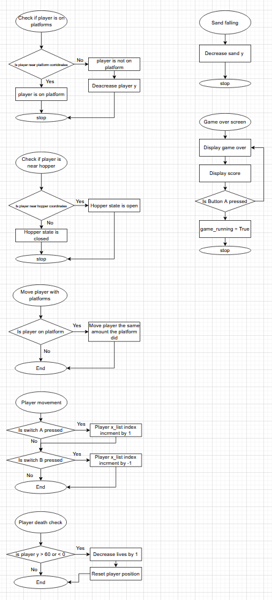
  
These subprocesses come together to make up the main game loop each solving a problem for my solution.
  
## Creating the sprites
I utilised two pieces of software to create my sprites: [pixilart.com](https://www.pixilart.com/ ) and excel.
  
### pixilart.com
This is an online website that is dedicated towords the creation of pixel art. I used this create the designs for my sprites. One very useful feature was the custom canvas size thus allowing me to draw my sprites in an area that would be the size of my technical solution's screen. This allowed me to easily think about how large my sprites should be. It also included erase functions for easy tweaks to sprites and a layer function so I could focus on individual sprites or all the pixels as a whole. 
  
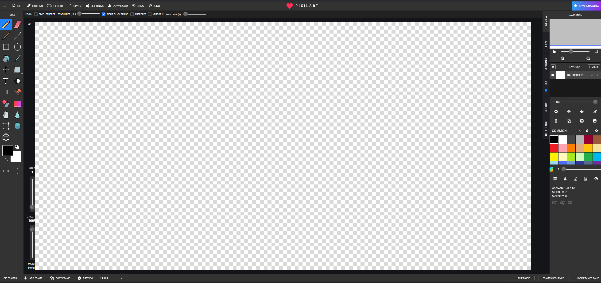
  
### Excel
Once I had all my sprites designed I had to find a way to convert them all into a format suitable for storing into a data structure so I could display them on screen. The data structure I decided on was 2D arrays and in them I would store either a 0 (white space) or a 1 (black space). In order to format my sprites designed in pxixilart I used excel. 
  
|I created 4 seperate grids: ||
| :-----------: | :-----------: |
|One where I would type a value of 1 or 0 which would then be converted into their respective colours. | 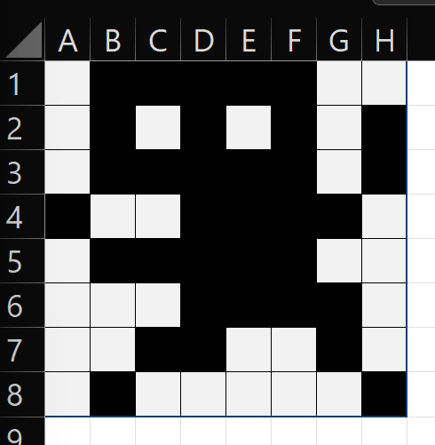 |
|The second grid was just displayed the 1s and 0s.|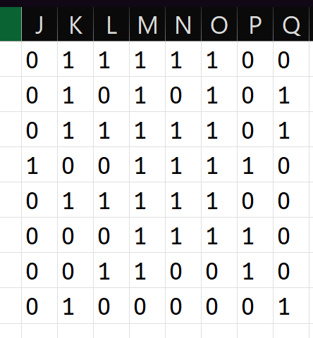|
|The third grid groups each row into an array format.|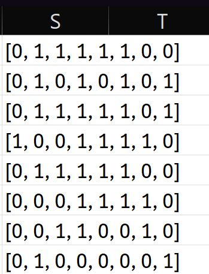|
|The fourth grid groups all the 1D arrays into a collective 2D array which I can paste into my code|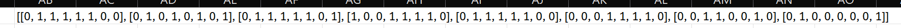|
  
To actually draw the sprites I utilised nested loops to cycle through the 2D arrays displaying a pixel when a 1 was present. 
  
## User interface
  
### Display
  
For this project I used a micro pico device which had a screen size limit of 128 * 64 and was monochrome. 
Therefore I had to design the user interface around this. 
  
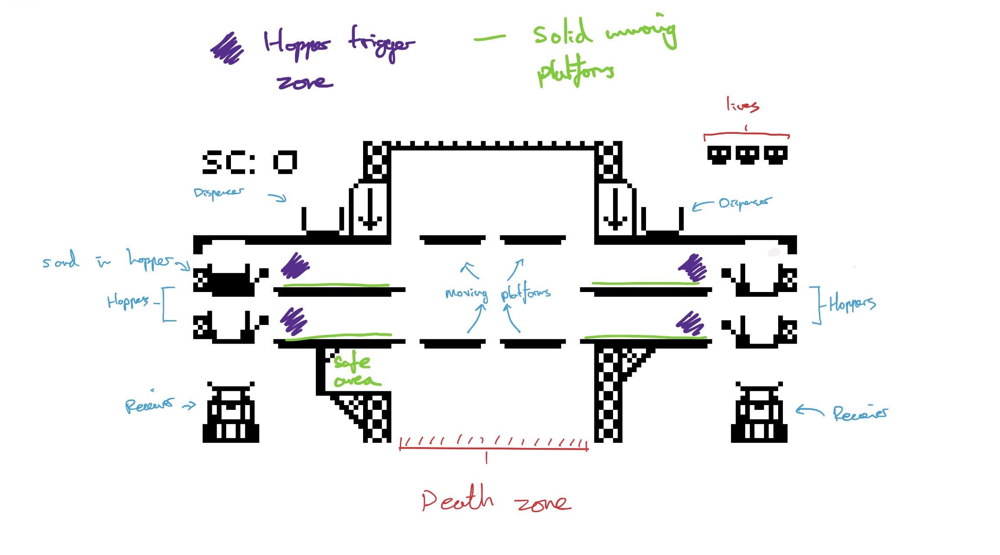
  
*Done in pixil art*
*Note: Play is meant to still live if on a moving platform in the death zone*
  
One limitation of the micro pico screen size that was extremely evident was with my player sprite which was limited to 8x8 therefor I had to create a simplistic yet unique and identifiable design for my player sprite. Another was with the Score displayer which I had to simplify int just "SC" instead of "SCORE" to save space.
  
### Sprites
  
| name | sprite |
| :-----------: | :-----------: |
| Stage left | 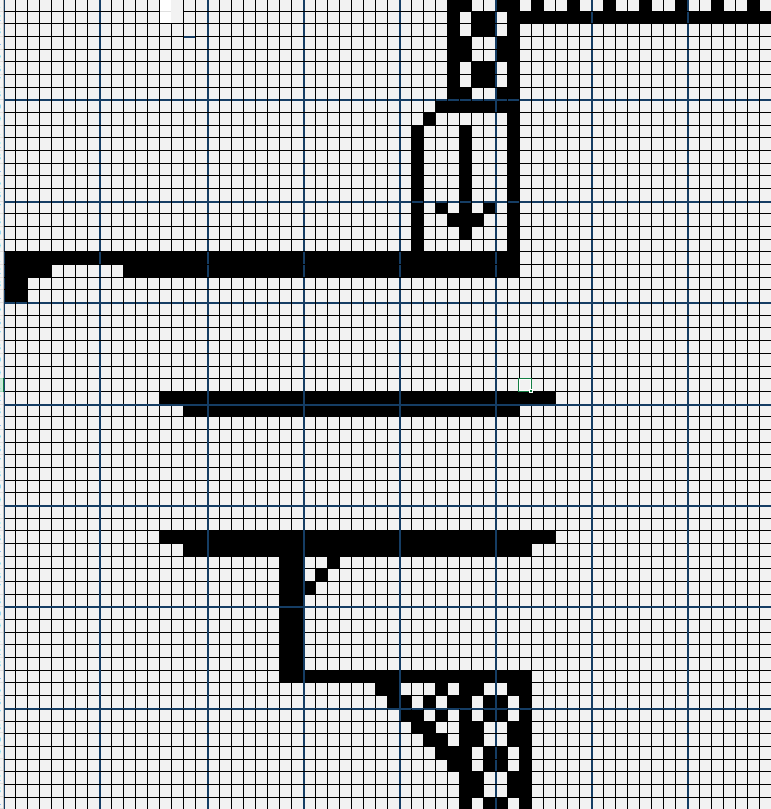 |
| Stage right | 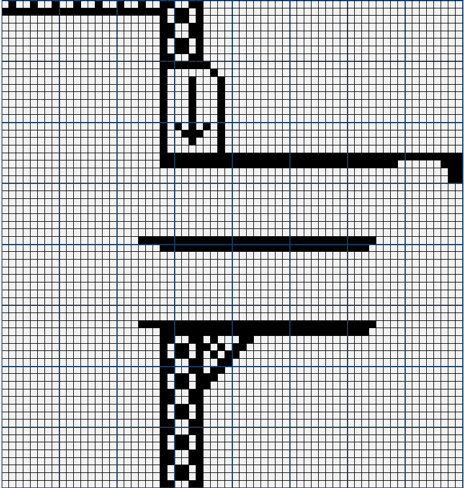 |
| Player character | 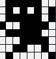 |
| Hoppers |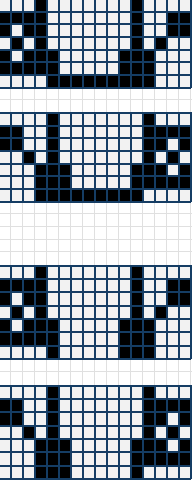 |
| Lives |  |
| Sand reciever | 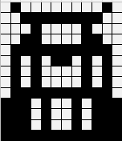 |
| Sand dispenser | 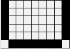 |
| sand |  |
  
  
### Player interaction
The human player interacts with the game through the pressing of 2 buttons on the micro pico "SWITCH_A" and "SWITCH_B". "SWITCH_A" moves the player left and "SWITCH_B" moves it right, "SWITCH_A" also serves as a button to restart the game once it "GAME OVERS". 
  
The user is able to track their player through the movement of the 8x8 player sprite. They also have to track the sand in the form of a 14x2 sprite. These stack up to three in hoppers to show the user how full each hopper is. 
  
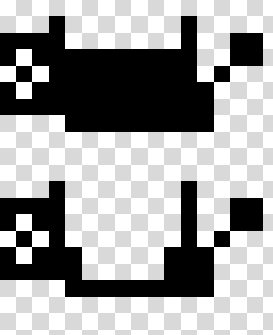
  
*Top hopper has 2 pieces of sand, bottom hopper has none*
  
## Algorithms
In order to create my technical solution I utilised several algorithms.
  
### Collision/Gravity *is_on_ground* algorithm
This algorithm determines if the player is standing on a solid platform pixel and if not applies gravity to the player sprite.
  
  * It takes in the inputs: players coordinates and width along with the array for the stage sprite. 
  * It outputs True or False depending on if the player is on a platform or not
  
**Pseudocode**
  
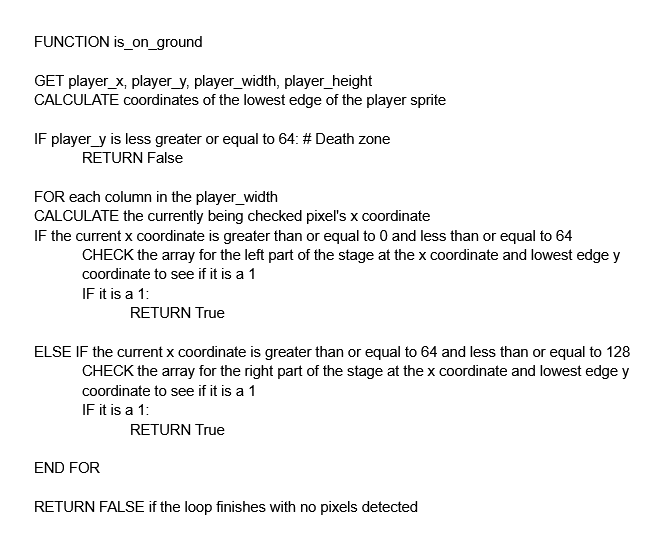
  
### Sand management *update_sand* algoritm
This algorithm keeps track of falling sand and sand in hoppers. It manages spawning new sand, sand overflow, sand collision with hoppers and calculating points.
  
  * It takes in the inputs: sand_spawn_timer, sand_spawn_timer, active_sand list, hopper_open states (Left, Right, Top, Bottom), mario.lives, and score.
  * It outputs: Updated coordinates for all active sand, updated hopper contents, modified score integer, and mario lives
  
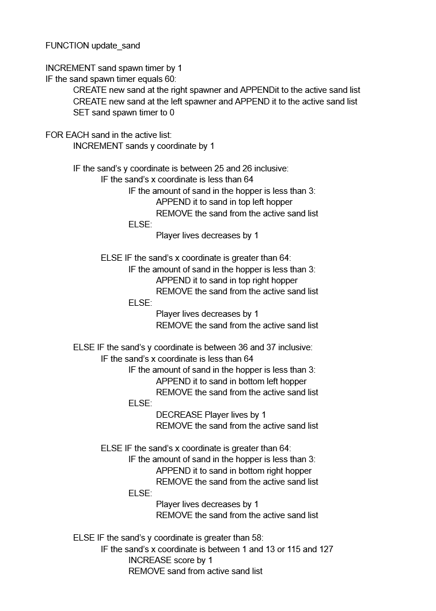
  
  
## Usage of object oriented programming
In this project I decided to encapsulate the Player character.
  
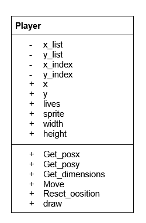
  
*UML diagram for player class*
  
### Attributes
Coordinate lists: x_list, y_list:  
I decided to use preset coordinates instead of unrestricted movement for the player character. These lists store the exact coordinates the player can go to when the user presses the movement inputs (apart from when on the moving platforms). 
  
Indicies: x_index, y_index:  
These allow the player sprites coordinates to change by changing the index relative to the lists. It allows the player sprite to move to the next coordinate in the list.
  
Lives:  
This starts at 3. It is stored in here so the game can easily check if the player is alive or not.
  
### Methods
Movement Logic: When the user presses a button the move methods check if the index is in the bounds of the coordinate lists. If it is then it invrements or decrements the index to move the player sprite.
  
Reset Logics: This method is called after a death. It respawns the player sprite back to its starting coordinates.
  
Draw Logic: This method allows the software to interact with the hardware to display the pixels that create the player sprite.
  
I decided to use encapsulation on the player class due to a number of factors
  * It makes the main game loop more tidy as it groups all the player related code together into a class.
  * It also simplifies the main game loop as it hides the complexity of subroutines in the class.
  * I would not have to edit anything in the main loop if I wanted to edit a player related subroutine. 
  * If I wanted to add an extra instance sprite that was similar I could add it very easily. E.g. A second player character or an enemy.
  * It also protects certain data such as the indexes so I don't accidently edit them and crash the code. 
  
## Technical Design choices
| Choice ||
| :-----------: | :-----------: |
| 2D arrays for sprites | They are memory efficient and easy to iterate through especially on such limited hardware |
| List of active sands | Using dictionaries allows the game to handle a variable amount of sand sprites at once. This means I don't need to code each individual sand. | 
| Splitting stage sprite into 2 main parts | Makes the stage sprite more manageable and easier to input into excel |
  
## ISPO Chart
| Type | Item | Description |
| :-----------: | :-----------: | :-----------: |
| **INPUT** | Switches | Physical buttons |
|| Sprite data| 2D arrays with 1s and 0s|
| **PROCESS** | Movement Logic | Changes index based on user inputs |
|| Collision detection | Checks if player sprite overlaps with stage sprite |
|| Sand logic | Calculates sand falling and also hopper collisions and storing |
|| Drawing Sprites | Iterates through sprite arrays to display pixels |
| **STORAGE** | Player object | Instance of player class stores things such as player coordinates lists and indexes |
|| Lists | Active sand stores variable number of sand, Current wait list used for platform timings | 
|| Variables | Scores, sand_spawn_timer, |
|| Constants | 2D arrays for sprites|
| **OUTPUT** | LCD display | monochrome 128x64 displays everything the user can see |
|| Scoreboard | outputs the score to the user |
  
  
  
  
## Technical Solution
<pre class="language-text"><code>EntryNotFound (FileSystemError): Error: ENOENT: no such file or directory, open &#39;c:\Users\Overl\Documents\GitHub\MiniNEA-YC-Proper\writeup\MiniNEA-YC-Proper\writeup\3. Technical Solutions.md&#39;</code></pre>  
  
## Testing
  
Throughout the process of making the game I made notes while testing my code in order to keep track of bugs so I could resolve them in order to create a smoother more functional experience.  
  
Goals: 
* Main objectives:
  * Create sprites, objective 1
  * Character movement objective 2
  * Falling of character when not on platform objective 3 
  * Hoppers
     * Interaction with Mario ,opening of hoppers objective 4
     * Capacity of 3 sand objective 5
  
  * Moving platforms
     * Mario moves with moving platforms if he is ontop of one objective 6
     * Moves at regular intervals objective 7
  
  * Point systems
     * Scoring system objective 8
     * Lives objective 9
     * Death system when not on a moving platform at the bottom of the elevator objective 10
     * Running out of lives end the game and shows a game over screen objective 11
  
  * Falling of sand objective 12
  * Resetting game when restart button is pressed objective 13
  
* Acceptable limitations:
   * Scoring values doubling once reaching 300 points
   * Leaderboard
   * Main menu
  
  
Test video: [https://youtu.be/LWSg3hDn908](https://youtu.be/LWSg3hDn908 )
  
| Stage Sprites          | Test             | Passed Y/N | Problems | Solution | Second test pass Y/N | Objective | Video timestamp |
| :-----------: | :--------------: | :--------------: | :--------------: | :--------------: | :--------------: | :--------------: | :--------------: |   
| Backdrop | Run the game. Move Mario around the platform and allow sand to fall and hoppers to open. Make sure backdrop remains static and unchanged | Y | | | | 1 | Whole video |
| Platforms Movement| Run Game for extended time period. Make sure the platforms are moving at a consistent slow enough speed | N | Platform would update it's position every frame this was too fast | Implemented a wait timer which only allowed the platform to move at set times | Y | 7 | whole video | 
| Platforms Boundaries| Run Game until platforms hit both the top and bottom of their movement range. Make sure platforms reverse movement direction when reaching boundary| N | Platforms moved off the screen at the top | Solution changed bounds | Y | 7 | 0:12 | 
  
| Mario         | Test             | Passed Y/N | Problems | Solution | Second test pass Y/N | Objective | Video timestamp  | 
| :-----------: | :--------------: | :--------------: | :--------------: | :--------------: | :--------------: | :--------------: | :--------------: |  
| Mario Sprite Left Right Position | Press left movement button once. Make sure Mario's sprite moves exactly one position to the left. Repeat for rightside movement | Y | | | |  2 | 0:06 |
| Mario Sprite Falling Position | Place Mario in a position where he is airborne, Make sure his character sprite moves down until it aligns with a platform | N | Mario would fall through the platform as he would only stay on the platform if he was in a pixel perfect position | Changed the moving platform detection to encompass a small area around the player and moving platform | Y | 2 | 0:26 |
| Mario Sprite Boundaries | Move Mario next to a hopper. Then try to move him into the hopper even more. Make sure Mario's position does not phase into or past the hopper | Y | | | | 2 | 0:10 |
| Interactions with platforms | Place Mario on a moving platform for 25. Make sure Mario moves in sync verticaly with the platform | N | Mario would fall through as soon as the platform moved | Made Mario teleport the same distance the platform did if he was detected as being on the moving platform. Also changed it so the platform would not move before the player sprite did causing a graphical inconsitensies | Y | 6 | 0:26 |
| Mario moving with platforms | Place Mario on a moving platform for 25 seconds. Make sure Mario moves with the correct platform | N | Mario would randomly teleport to different platforms due to 2 conflicting sections of snapping to platform code, each was fighting to control Marios position | Deleted conflicting sections | Y |  6 | 0:26 |
  
  
| Hopper mechanics          | Test             | Passed Y/N | Problems | Solution | Second test pass Y/N | Objective | Video timestamp | 
| :-----------: | :--------------: | :--------------: | :--------------: | :--------------: | :--------------: | :--------------: | :--------------: |  
| Player sprite interactions with hoppers| Move Mario next to a hopper. The sand should be allowed to fall through | N | Boundaries for how close mario needed be were incorrect | Changed bounds | Y | 4 | 01:12 |
| Holding of sand | Allow the game to run. Do not open hoppers. sand should not fall through the closed hoppers | Y | | | | 5 | 0:09 |
| Stacking of sand | Allow the game to run. Do not open hoppers. sand sprites should stack one ontop of another | N | Sand would just fall into the same y coordinates so you could not see how many there were in a hopper | Created a seperate subroutine to draw stacked sand specifically| Y | 5 | 01:21 - 01:36 | 
| Stacking of sand overfill | Allow the game to run. Do not open hoppers. When hopper is holding 4 or more sand the game should end | Y | | | | 5 | 01:43 |
| Dispenser hopper's opening timing | Allow the game to run. Dispenser hoppers should dispense sand at fixed intervals| Y | | | | 4 | whole video |
  
| Sand Mechanics          | Test             | Passed Y/N | Problems | Solution | Second test pass Y/N | Objective | Video timestamp | 
| :-----------: | :--------------: | :--------------: | :--------------: | :--------------: | :--------------: | :--------------: | :--------------: |  
| Falling sand | Allow the game to run. Make sure the sand sprite moves downwards if it is not in a closed hopper  | Y | | | |  12 | whole video |
| Falling into truck | Allow game to run. Allow the sand to fall to the trucks. Make sure the sand sprite is deleted when it hits the truck and score is increased by 1 for each sand | N | Sand did not delete early enough | Changed bounds for sand deletion | Y | 12 | 01:35 | 
  
  
| Stage Hazards         | Test             | Passed Y/N | Problems | Solution | Second test pass Y/N | Objective | Video timestamp |
| :-----------: | :--------------: | :--------------: | :--------------: | :--------------: | :--------------: | :--------------: | :--------------: |  
| Falling to the bottom of the stage | Make sure when Mario reaches the bottom of the stage and is not on a moving platform that he loses a life| N | Mario died too early | Changed the death zone bounds | Y | 10 | 01:18 |
| When life is lost 1 life sprite should be removed | Y | | | | |10 and 9 | 01:18 |
  
| Extra systems          | Test             | Passed Y/N | Problems | Solution | Second test pass Y/N | Objective | Video timestamp | 
| :-----------: | :--------------: | :--------------: | :--------------: | :--------------: | :--------------: | :--------------: | :--------------: |  
| Endgame | Run the game until Mario runs out of lives. Screen should switch to game over display | Y | | | |  11 | 0:52 |
| Reset lives | Press Switch A once the game over screen is shown. Lives should reset to 3 | Y | | | | 11 | 0:54 |
| Reset position | Press Switch A once the game over screen is shown. The display should switch to the stage screen, Mario's position should reset to starting coordinates | N | List index conflicted with position so Mario would spawn then immediatly be teleported elsewhere | Made sure to reset indexes on death | Y | 13 | 0:54 |
  
In conclusion I managed to fix a number of issues with my code through numerous iterations of it, learning from each failed iteration to improve the overall code. 
  
  
  
  
  
  
  
## Evaluation
  
## Objectives met
  
| Objective | Achieved Y/N |  Outcome|
| :-----------: | :-----------: | :-----------: |
| Create sprites | Y | Overall I think this was a success I managed to design sprites and display them on screen in a way that would be possible with my hardware restirictions |
| Character movement | Y | I believe I made the correct choice in using preset coordinates for the sprites due to the hardware restrictions as it reduced lag and chance of bugs occuring |
| Falling of character | Y | This was done using pixel detection which allowed the sprite to not fall when standing on solid platforms, created gravity simulation for falling character |
| Falling of sand | Y | Sand fell down due to gravity unless if it was in a hopper | 
| Interaction of hoopers with Mario | Y | This was completed to a satisfactory level as the hoppers opened in the correct circumstances |
| Capacity of hoppers | Y | This was achieved properly as the hopepr could display the amount of sand in it and also would be able to decrease lives if it overflowed | 
| Moving platforms | Y | This was done to a satsifactory level as the platforms moved at a constant rate and if the player character was on it it would move with the platform. |
| Scoring | Y | Achieved as when sand falls into recievers 1 is added to the score |
| Death zone | Y | Player loses life when reaching the bottom of the screen |
  
  
## Future improvement 
  
One main thing I would change if I were to do this again is to encapsulate the sand, hopper and moving platforms not just the player. This would allow me to create instances of these objects easier without having to repeat code. It would also make my main game loop code look much more clean and maintainable. Also to make the code more maintainable I could combine all the sprite drawing functions into one primary one in order to remove repeated code.
  
If I could use better hardware I could consider creating mroe detailed sprites along with animations for things such as player sprite running, hopper opening, levers on the hoppers. This would provide a better looking game and user experience. Also I could consider keeping track of high scores. 
  
For the actual game loop I would consider scoring changes such as bonus points at certain time periods or once a certain score is increased. Or ways to regain lives. 
  
  
## Indpendant Feedback
  
I asked my brother to play the game and one of his points really stood out to me. I could consider random platform movement timings and also random sand spawning timings. 
  
*" I think the game is a bit too easy, I think random sand spawning or platform moving would make it harder. "*
  
I then asked my primary Jazz Guan user for feeback. 
  
*" I think animiations would improve my experience, also the movement can feel clunky at times, sometimes it moves too much and sometimes not at all. "*
  
| Feedback | My opinion |
| :-----------: | :-----------: |
| Random platform movement timings | I disagree with this as I believe having predictable platform movement allows for better skill expression. However I what I would add is a set rotation of platform movement timings therefore a skilled player could memorise these patterns and find an optimum way of moving around the stage | 
| Random sand spawning timings | I agree with this as the spawn time between each sand spawning would still be kept at a reasonable amount of time while adding an aspect of randomness which would force the user to move around the stage faster increasing the difficulty in a meaningful way.|
| Animtations | I think this could be done in a relatively simple way by redrawing the sprite during interactions such as movement and hopper openings. This however could also lag the game due to the limited hardware. |
| Clunky movement| This I agree with although I believe this may be a hardware limiation as it struggles with processing multiple things at the same time. I could implement this by increase the wait time between actions but this could make the game feel even worse to play |
  
  
## Conculsion
Overall I believe I have developed a technical solution that hits the objectives I set out. It achieves the goal of creating a handheld game from the Nintendo Game and Watch (Mario's Cement Factory"). I believe I have created a fun user experience that suits the target audience. I used succesive testing to improve the game removing bugs and improving the smoothness of gameplay while documenting my process in a clear and concise way. It also achieved my own goal in improving my programming skills particularly in object oriented programming. I also learned new python techniques such as list slicing and improved my usage of libraries. 
  
There are some improvements that I could add in future namely, leaderboad and increasing the difficulty of the game as the user scores more points. However, I believe the final product still fuffills it's intended design albeit lacking some of the polish and robustness a proper game in the proffesinal industry would have. 
  
  